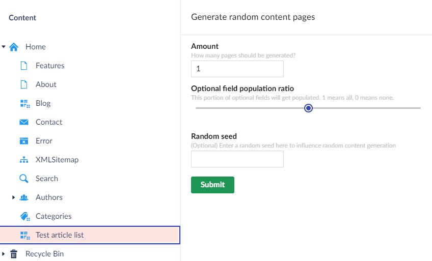

<h3 align="center">

</h3>

<h1 align="center">
Content Generator
</h1>

## Introduction
The content generator is a small tool that can help you to easily create any content item so you can quickly have some content to work with.
Right now the tool only supports randomized test content, but in the future might support more sophisticated generators. This tool supports Umbraco 10 and Umbraco 13.

## Getting started
Install `Infocaster.Umbraco.ContentGenerator` from nuget using the following dotnet command:

```
dotnet add package Infocaster.Umbraco.ContentGenerator
```

Once installed, you don't need to configure anything. You can get started using the tool straight away.

1. Log in to the backoffice
2. Locate a parent content item in the content tree
3. Right click the three dots on the content item in the content tree
4. Select "Generate random content"
5. Select various options for your generated content and press "Submit"
6. Wait for the process to finish
7. Refresh your page to see your generated content.



## Configuration
You may paste the following configuration into the root of your appsettings.json:

```json
{
    "ContentGenerator": {
        "Enabled": true
    }
}
```

By setting `Enabled` to false, you remove the context menu from the backoffice.

## Support
This is a pre-release early access tool. It is offered to you because you might find it useful. You can ask for features or bugfixes, but we don't guarantee support on this tool. You are welcome to suggest pull requests to improve this product though.

<a href="https://infocaster.net">

</a>